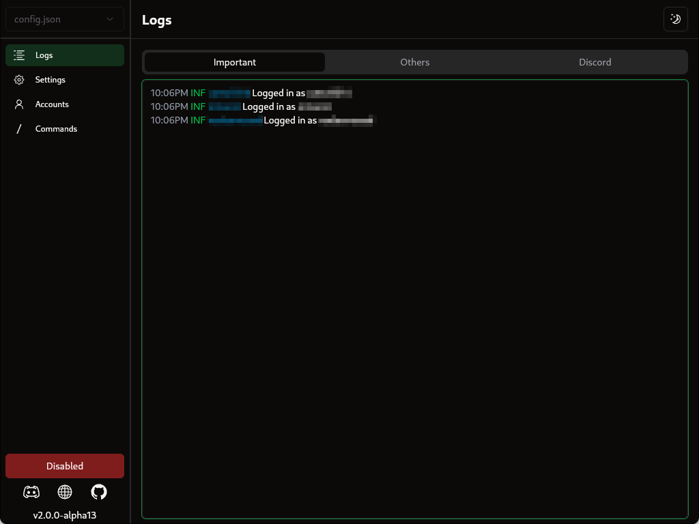
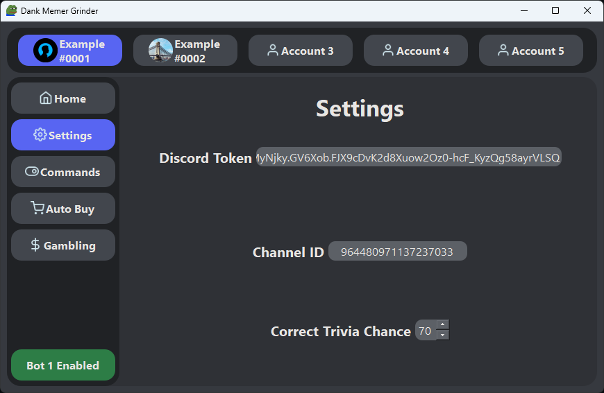
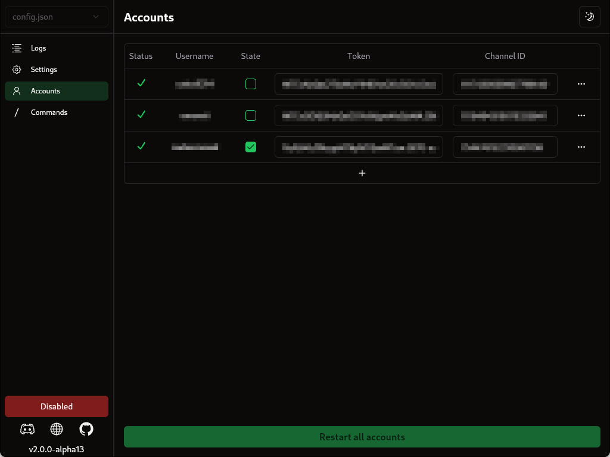

 

  

  # 

  ### Supercharge your [Dank Memer](https://dankmemer.lol/) experience
  <a href="#features">Features</a>
  ·
  <a href="https://dankmemer.tools/download">Download</a>
  ·
  <a href="https://docs.dankmemer.tools/">Documentation</a>
  ·
  <a href="https://dankmemer.tools/">Website</a>

  
  
  

  
  
  

> 🚨 WARNING: USE AT YOUR OWN RISK. This is a self-bot and is in violation of Discord's and Dank Memer's rules and TOS. By using this software, you acknowledge that we take no responsibility for any action taken against your account, whether by Discord or Dank Memer.
>
> It is crucial that you take appropriate measures to avoid detection. These measures include:
> <ol>
>  <li>Running the bot only in private channels.</li>
>  <li>Not being open about the fact that you use it.</li>
>  <li>If you run the bot excessively, no matter the outcome of captchas. Big surprise, if you farm for 12 hours straight then they might think you're a little bit sussy. So if you script for an unnatural amount of time, then don't be surprised if you get banned for that very reason.</li>
> </ol>

## Features
A detailed breakdown of features are available in our [**<u>documentation</u>**](qvTXA2wRfP).

-   [x] **Undetectable:** Mimics native api's used by official discord clients, making it impossible for discord to tell the difference.
-   [x] **Accurate and Cheap Captcha Solver (Not public yet):** Automatically solve captchas on many accounts while being undetectable, only at $0.005 per captcha solved ($0.5 / 100 captchas).
-   [x] **Performant:** DMG is written in Go with a focus on speed, using minimal system resources in the background.
-   [x] **Highly Customizable:** Through DMG's modern GUI, everything from search priorities to adventure answers can be easily customized to your hearts content.
-   [x] **Feature Rich:** DMG supports and automates most minigames and commands, from /pets care to the moleman minigame. Fishing support is coming soon.
-   [x] **Multi-Platform Executables** No more installing python or node. Just download and run the executable file available for Windows, macOS and Linux.

  
  
  
  

## Documentation

### Installation
- [Pre-Built binaries (Recommended)](https://docs.dankmemer.tools/installation/pre-built-binaries)
- [Build from source](https://docs.dankmemer.tools/installation/build-from-source)

### Getting Started
- [Entering token and channel ID](https://docs.dankmemer.tools/configuration/entering-token-and-channel-id)
- [config.json file](https://docs.dankmemer.tools/configuration/config-json)
- [General settings](https://docs.dankmemer.tools/configuration/general-settings)
- [Commands Settings](https://docs.dankmemer.tools/configuration/commands-settings)
- [Auto buy settings](https://docs.dankmemer.tools/configuration/auto-buy-settings)
- [Auto use settings](https://docs.dankmemer.tools/configuration/auto-use-settings)

### Features
- [Commands](https://docs.dankmemer.tools/features/commands)
- [Minigames](https://docs.dankmemer.tools/features/minigames)

## Credits
- [dgate](https://github.com/LuminalDev/dgate)
- [disgo](https://github.com/disgoorg/disgo)
- [catchtwo](https://github.com/kyan0045/CatchTwo)
- [slashy](https://github.com/TahaGorme/slashy)

