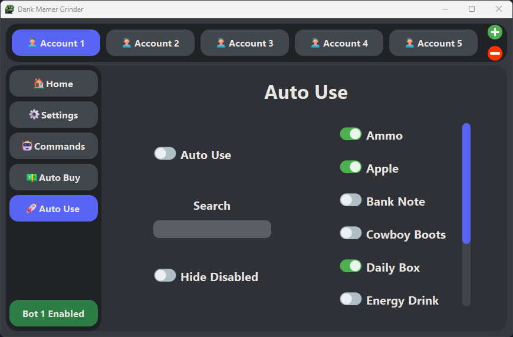

 

  

  # 

  ### Supercharge your Dank Memer experience with Dank Memer Grinder

  
  
  

  

> 🚨 WARNING: USE AT YOUR OWN RISK. This is a self-bot and is in violation of Discord's and Dank Memer's rules and TOS. By using this software, you acknowledge that we take no responsibility for any action taken against your account, whether by Discord or Dank Memer.
>
>Possible actions that could be taken against your account include but are not limited to suspension or termination.
>
> It is crucial that you take appropriate measures to avoid detection. These measures include:
> <ol>
>  <li>Running the bot only in private channels.</li>
>  <li>Not being open about the fact that you use it.</li>
>  <li>Avoiding running the bot excessively to prevent raising suspicion.</li>
> </ol>
> Remember, using this bot comes with significant risks, and you must take appropriate measures to protect your account from any consequences.
      

## Features
Find a detailed breakdown of all the features in our [**<u>documentation</u>**](https://docs.dankmemer.tools/features).

-   [x] **Up-to-date High Accuracy AI-Based Captcha Solver**
-   [x] **User-Friendly GUI:** Easy configuration and log management
-   [x] **Multi-Account Support:** Run unlimited accounts simultaneously
-   [x] **Automatic Updates:** Stay up-to-date with the latest version
-   [x] **Currency Commands and Minigames Automation:** Adventure, work, pets care, moleman, dragons and more
-   [x] **Search and Crime Locations:** Customizable location priority list
-   [x] **Lifesaver Management:** Purchases lifesavers when balance falls below a configurable amount
-   [x] **Auto Buy:** Automatically buys fishing poles, hunting rifles, and shovels
-   [x] **Appear Offline:** Option to appear offline in your Discord status
-   [x] **Resource Efficiency:** Uses minimal system resources and works without Discord app

  
  
  
  

## Documentation

### Installation
- [Windows](https://docs.dankmemer.tools/installation/windows)
- [macOS](https://docs.dankmemer.tools/installation/macos)
- [Linux](https://docs.dankmemer.tools/installation/linux)

### Getting Started
- [Getting Your Discord Token](https://docs.dankmemer.tools/configuration/getting-your-discord-token)
- [Getting Your Channel ID](https://docs.dankmemer.tools/configuration/getting-your-channel-id)
- [General Settings](https://docs.dankmemer.tools/configuration/general-settings)
- [Commands Settings](https://docs.dankmemer.tools/configuration/commands-settings)

### Features
- [Commands](https://docs.dankmemer.tools/features/commands)
- [Minigames](https://docs.dankmemer.tools/features/minigames)
- [Auto Buy](https://docs.dankmemer.tools/features/auto-buy)
- [Auto Use](https://docs.dankmemer.tools/features/auto-use)

## Links
- [Documentation](https://docs.dankmemer.tools)
- [Discord Server](https://discord.gg/KTrmQnhCHb)

