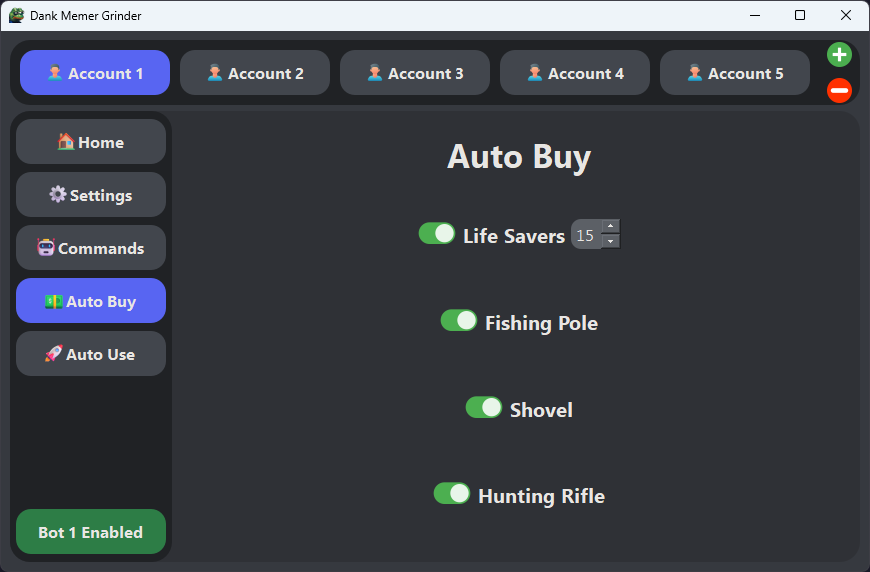

 

  

  # 

  ### An up-to-date GUI based Discord Selfbot for Grinding Dank Memer

  
  
  
  

  

> 🚨 USE AT YOUR OWN RISK: This is a self-bot. Such bots are against Discord's and Dank Memer's rules and TOS. By using this software you acknowledge that we take no responsibility whatsoever for any action taken against your account, whether by Discord or Dank Memer.
>
> Despite this, there is no chance of detection by either Discord or Dank Memer provided that you take appropriate measures to ensure this. This includes but is not limited to running the bot only in private channels, not being open about the fact that you use it and not running so much as to raise suspicion.

## Features

-   [x] Easy to use GUI for configuration and logs
-   [x] Support for running unlimited accounts at once
-   [x] Automatic updater
-   [x] Automation of most currency commands and minigames (e.g. all work minigames, pets care, moleman, dragons, kraken, legendary fish)
-   [x] Automatically selects and streams the daily trending game
-   [x] Answers all trivia questions with a configurable chance in order to avoid suspiscion
-   [x] Automatically searches the best places to avoid death
-   [x] Automatically buy fishing poles, hunting rifles, shovels or pizza's
-   [x] Automatically buys lifesavers when under a configurable amount
-   [x] Appear offline in discord status
-   [x] Auto read alerts
-   [x] Uses very little system resources

  
  
  
  

## Installation

### Installing from release (recommended)

1. Download the latest release for your operating system [here](https://github.com/BridgeSenseDev/Dank-Memer-Grinder/releases/).
2. Extract the downloaded zip file.
3. Run the binary by doing the following:

* **Windows:** Double click `Dank Memer Grinder.exe`.
* **Linux and macOS:** Open a terminal window, and navigate to the folder the files were extracted to. Run `./Dank\ Memer\ Grinder` in a terminal.

> **Note** If you are on **Linux or macOS**, you may have to execute **`chmod +x path_to_binary`** in a shell to be able to run the binary.

### Installing from source (unstable)

* Download and install [Python](https://www.python.org/downloads/).
* Run the command `git clone https://github.com/BridgeSenseDev/Dank-Memer-Grinder.git` in a terminal.
* Run the command `cd Dank-Memer-Grinder` in a terminal.
* Run the command `pip install -r .\requirements.txt` in a terminal.
* Rename `config.json.example` to `config.json`.
* To start the program, run the command `python main.py` in a terminal.

### Getting Started

1. Go to the settings tab and enter your discord auth token [(how to get)](https://www.youtube.com/watch?v=YEgFvgg7ZPI) and channel id [(how to get)](https://support.discord.com/hc/en-us/articles/206346498-Where-can-I-find-my-User-Server-Message-ID-#:~:text=On%20Android%20press%20and%20hold,name%20and%20select%20Copy%20ID).
2. Go to the autobuy tab and turn everything on **(recommended)**. Make sure to set lifesavers to at least 4 **(recommended)**.
3. Go to the commands tab and toggle the commands to your liking.
4. Start / Stop the entire bot using the toggle on the bottom left.
5. Repeat steps **1-4** for as many accounts as you would like.
