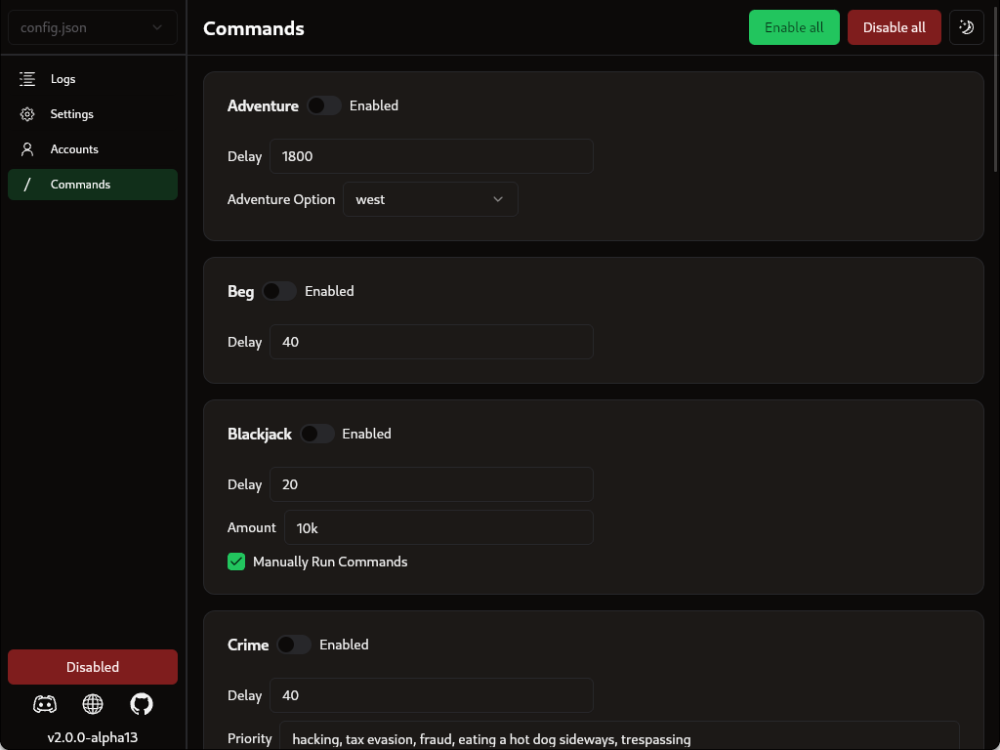

<br />
<p align="center">
   
</p>
  <h1 align="center">
   <a href="https://git.io/typing-svg"></a>
  </h1>
  
<h3 align="center">
  An up-to-date GUI based Discord Selfbot for Grinding Dank Memer
</h3>

<p align="center">
  
  
  <br>
  <a href="https://discord.gg/KTrmQnhCHb"></a>
</p>

> 🚨 USE AT YOUR OWN RISK:
> This is a self-bot. Such bots are against Discord's and Dank Memer's rules and TOS. By using this software you acknowledge that we take no responsibility whatsoever for any action taken against your account, whether by Discord or Dank Memer.

> Despite this, there is no chance of detection by either Discord or Dank Memer provided that you take appropriate measures to ensure this. This includes but is not limited to running the bot only in private channels, not being open about the fact that you use it and not running so much as to raise suspicion.

### Features
- [x] Easy to use GUI for configuration and logs
- [x] Support for running up to 5 accounts at once
- [x] Automatic updater
- [x] Automation of most currency commands and minigames (e.g. all work minigames, dragons, kraken, legendary fish, moleman)
- [x] Automatically selects and streams the daily trending game
- [x] Answers all trivia questions with a configurable chance in order to avoid suspiscion
- [x] Automatically searches the best places to avoid death
- [x] Automatically buy fishing poles, hunting rifles, shovels or pizza's
- [x] Automatically buys lifesavers when under a configurable amount
- [x] Uses very little system resources

<p align="center">
   
   
   
   
</p>

## Configuration
   ### Installing from release (recommended)
   1. Download the latest release for your opperating system [here](https://github.com/BridgeSenseDev/Dank-Memer-Grinder/releases/)
   2. Extract the downloaded zip file
   3. Run the binary
      #### Windows
      Double click `Dank Memer Grinder.exe`

      #### Linux
      Open a terminal window and navigate to the folder the files were extracted to and run `./Dank\ Memer\ Grinder`

      #### Mac 
      Open a terminal window and navigate to the folder the files were extracted to and run `./Dank\ Memer\ Grinder`
   ### Installing from source (unstable)
   Download [python](https://www.python.org/downloads/)
   ```
   git clone https://github.com/BridgeSenseDev/Dank-Memer-Grinder.git
   ```
   ```
   cd Dank-Memer-Grinder
   ```
   ```
   pip install -r .\requirements.txt
   ```
   Rename config.json.example to config.json
   ```
   python main.py
   ```
   
   ### Getting Started
   1. Go to the settings tab and enter your discord auth token [(how)](https://www.youtube.com/watch?v=YEgFvgg7ZPI) and channel id [(how)](https://support.discord.com/hc/en-us/articles/206346498-Where-can-I-find-my-User-Server-Message-ID-#:~:text=On%20Android%20press%20and%20hold,name%20and%20select%20Copy%20ID.)
   2. Go to the autobuy tab and turn everything on (recommended). Make sure to set lifesavers to at least 4 (recommended)
   3. Go to the commands tab and toggle the commands to your liking
   4. Start / Stop the entire bot using the toggle on the bottom left
   5. Repeat steps 1-4 for as many accounts as you would like
