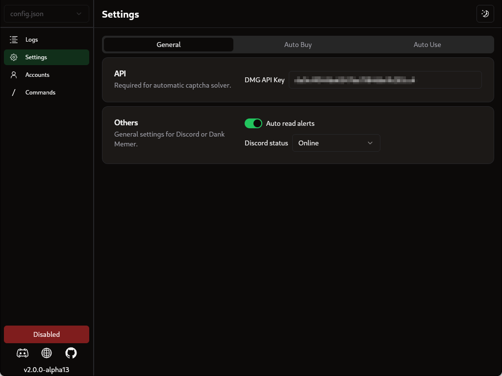

 

  

  # 

  ### An up-to-date GUI based Discord Selfbot for Grinding Dank Memer

  
  
  
  

  

> 🚨 WARNING: USE AT YOUR OWN RISK. This is a self-bot and is in violation of Discord's and Dank Memer's rules and TOS. By using this software, you acknowledge that we take no responsibility for any action taken against your account, whether by Discord or Dank Memer.
>
>Possible actions that could be taken against your account include but are not limited to suspension or termination.
>
> It is crucial that you take appropriate measures to avoid detection. These measures include:
> <ol>
>  <li>Running the bot only in private channels.</li>
>  <li>Not being open about the fact that you use it.</li>
>  <li>Avoiding running the bot excessively to prevent raising suspicion.</li>
> </ol>
> Remember, using this bot comes with significant risks, and you must take appropriate measures to protect your account from any consequences.
      

## Features

-   [x] User-friendly GUI for easy configuration and log management
-   [x] Supports running unlimited accounts simultaneously
-   [x] Automatically updates to the latest version
-   [x] Automates currency commands and minigames, such as work, pets care, moleman, dragons, kraken, and legendary fish
-   [x] Automatically selects and streams the daily trending game
-   [x] Randomizes answers to trivia questions to avoid suspicion
-   [x] Finds safe locations to avoid danger automatically
-   [x] Automatically purchases fishing poles, hunting rifles and shovels
-   [x] Buys lifesavers when it falls below a configurable amount
-   [x] Option to appear offline in Discord status
-   [x] Automatically reads alerts
-   [x] Uses minimal system resources.

  
  
  
  

## Installation

### Installing from release (recommended)

1. Download the latest release for your operating system [here](https://github.com/BridgeSenseDev/Dank-Memer-Grinder/releases/).
2. Extract the downloaded zip file.
3. Run the binary by doing the following:

* **Windows:** Double click `Dank Memer Grinder.exe`.
* **Linux and macOS:** Open a terminal window, and navigate to the folder the files were extracted to. Then run `chmod +x ./Dank\ Memer\ Grinder` and `./Dank\ Memer\ Grinder` in the terminal.

### Installing from source (unstable)

* Download and install [Python](https://www.python.org/downloads/).
* Run the command `git clone https://github.com/BridgeSenseDev/Dank-Memer-Grinder.git` in a terminal.
* Run the command `cd Dank-Memer-Grinder` in a terminal.
* Run the command `pip install -r .\requirements.txt` in a terminal.
* Edit `main.py` and change the config infomation on line 48. **after first run please edit config.json.**
* To start the program, run the command `python main.py` in a terminal.

### Getting Started

1. Go to the settings tab and enter your discord auth token [(how to get)](https://www.youtube.com/watch?v=YEgFvgg7ZPI) and channel id [(how to get)](https://support.discord.com/hc/en-us/articles/206346498-Where-can-I-find-my-User-Server-Message-ID-#:~:text=On%20Android%20press%20and%20hold,name%20and%20select%20Copy%20ID).
2. Go to the autobuy tab and turn everything on **(recommended)**. Make sure to set lifesavers to at least 4 **(recommended)**.
3. Go to the commands tab and toggle the commands to your liking.
4. Start / Stop the entire bot using the toggle on the bottom left.
5. Repeat steps **1-4** for as many accounts as you would like.
