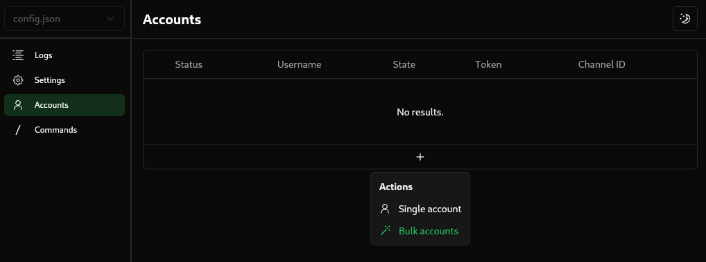

# Entering Token and Channel ID

## Adding accounts

Navigate to the Accounts tab and click the plus button under the table. There are two options:

* Single account:
  * Enter your [Discord token](getting-your-channel-id.md#getting-discord-token) and [channel ID](getting-your-channel-id.md#getting-channel-id) and click `Add account`&#x20;
* Bulk accounts:
  * Import a list of Discord tokens with channel ID's in various formats from a file on your computer

<figure><figcaption></figcaption></figure>

## Getting Discord token

Follow the steps [here](https://gist.github.com/MarvNC/e601f3603df22f36ebd3102c501116c6#file-get-discord-token-from-browser-md) to get your Discord Token from the Browser Console safely.

## Getting channel ID

Your Chanel ID is needed to specify which channel the self-bot should send commands in. Follow these steps to find and copy your channel ID.

1. **Open Discord Settings**

Open your Discord client, and click on the settings wheel icon in the bottom-left corner. This is in the group of icons that are shown alongside your avatar and Discord username.

<figure><figcaption>
To open Discord's User Settings, click the cog wheel as shown here.
</figcaption></figure>

2. **Opening Advanced Settings**

Navigate to the left-hand side menu and go to the option that says "Advanced". Click this in order to open up the Advanced Settings pane.

Once the Advanced Settings pane has appeared, this will contain the option to enable Discord Developer mode. If there is a green check mark inside the switch, then it is already enabled, but if there isn't, simply click the toggle to enable Developer Mode.

<figure><figcaption>
Enable Developer Mode
</figcaption></figure>

3. **Navigate to the Channel**

Navigate to the discord channel where you want the bot to grind in.


It is recommended to grind in private servers to avoid being reported by others.


4. **Copy to Clipboard**

To get the channel ID, right-click the channel name, and a drop-down menu will appear. Click the **"Copy Channel ID"** button as shown below to copy it. Paste the full channel ID into the **"Channel ID"** field from the settings tab of DMG.

<figure><figcaption>
Click "Copy Channel ID"
</figcaption></figure>
