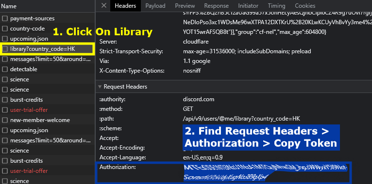

# Getting Your Discord Token

Your Discord token is needed to for the self-bot to grind on your discord account. Follow these  steps to find and copy your token:

1. **Open discord in your web browser**

Open your Discord in a web browser in order to find your Discord token. [Click here](https://discord.com/) to directly open the discord in a new tab. After clicking the link, Click on “Open Discord in your browser”.

2. #### Login into your Discord Account

Now, log in with your Discord credentials and sign in using a web browser. Please ensure that you are using a web browser for this process.

3. #### Press “Ctrl” + “Shift” + “I” to Open Inspect Element

Once you are logged in, open the Development Tools and Press **`“Ctrl” + “Shift” + “I”`** on your keyboard.


If you are using macOS, press **`Cmd`` ``+ Option + I`** instead


4. **Go to “Network” and press “F5”**

After opening developer tools, you should see several tabs such as Elements, Console, Sources, Network etc. Click on the **"Network"** tab at the top of the developer tools window and press `F5` on your keyboard to reload the Discord page.

5. **Search for “api” and navigate to “Library”**

After opening the Network tab and reloading, navigate to the filter box on the top left and type **“api”**. to search for Discord APIs. Now in Name select **“Library”**.

<figure><figcaption>
Searching "api" in Network Tab
</figcaption></figure>

6. #### Find for “Authorization” and copy your Discord token

After clicking on library under Name, scroll down until you see the `Request Headers` section. Under this section, find `Authorization:`, then highlight and copy the full token

<figure><figcaption>
Copying your Discord Token
</figcaption></figure>

7. Copy and Paste the full token into the **"Discord Token"** field from the settings tab of Dank Memer Grinder.

After entering your token, enter the **"Channel ID"** you want to grind in.


[getting-your-channel-id.md](getting-your-channel-id.md)


After entering in a correct token and channel id, you will now be logged in to Dank Memer Grinder.
