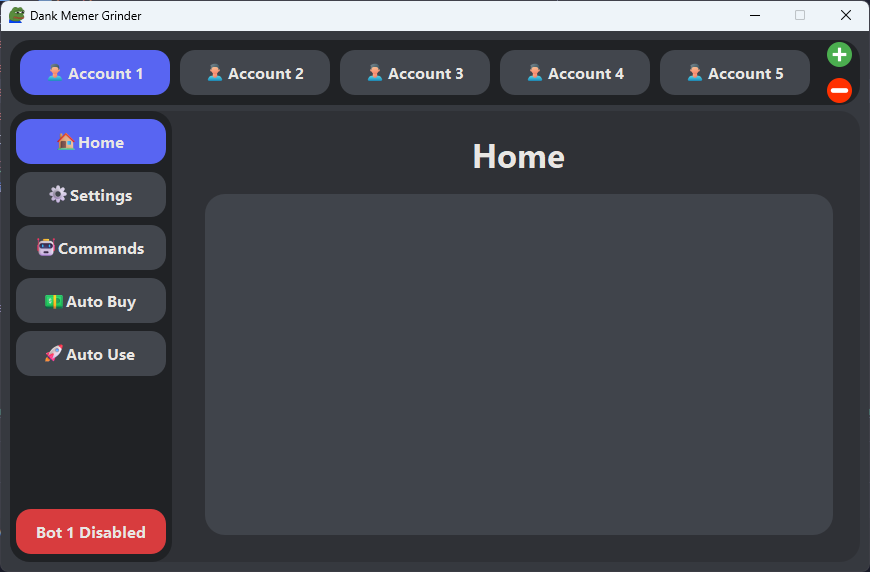
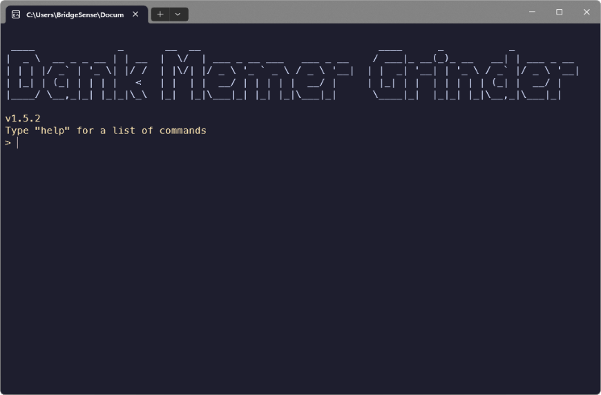

# Windows


Dank Memer Grinder only supports windows 10 or 11.


### Download Dank Memer Grinder

1. Find the latest release of Dank Memer Grinder from the [github](https://github.com/BridgeSenseDev/Dank-Memer-Grinder/releases/)
2. Scroll down to the Assets of the release
3. Click the Windows folder to open it
4. Click  `Dank Memer Grinder.exe` or `Dank Memer CLI.exe` to download them

### Running Dank Memer Grinder

Run Dank Memer Grinder by double clicking on the executable from within your Downloads folder. It may be necessary to exclude Dank Memer Grinder from your antivirus software, or tell Windows to Run Anyway.

<figure><figcaption>
A screenshot of Dank Memer Grinder GUI.
</figcaption></figure>

 

<figure><figcaption>
A screenshot of Dank Memer Grinder CLI.
</figcaption></figure>

After installation, you can start using and configuring Dank Memer Grinder.


[getting-your-discord-token.md](../configuration/getting-your-discord-token.md)

